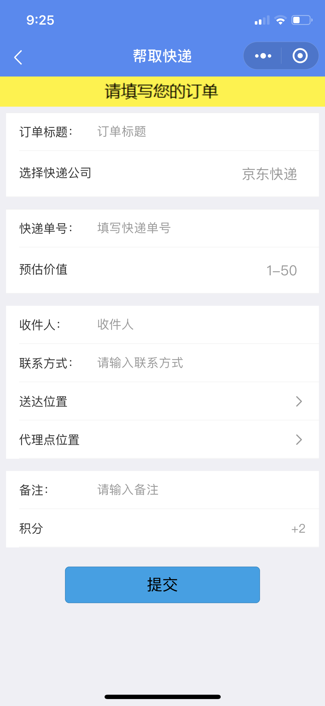
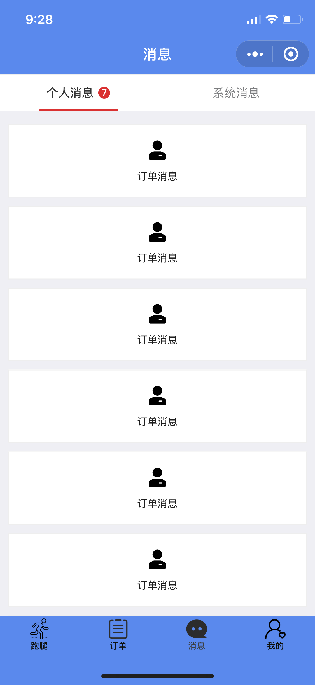
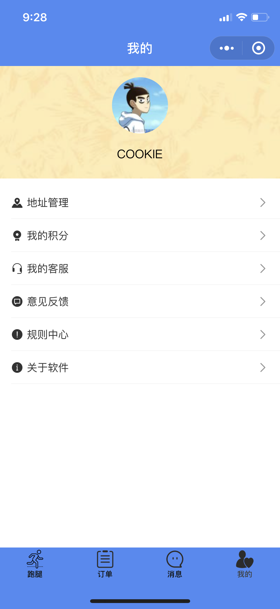
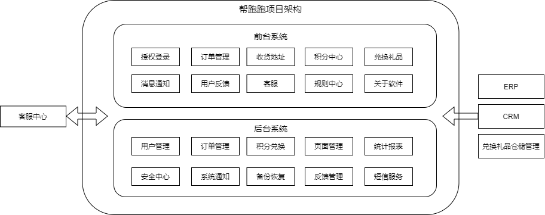
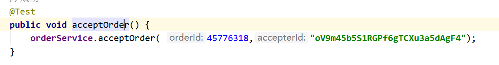
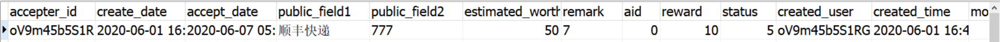
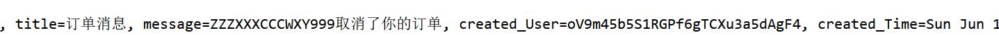
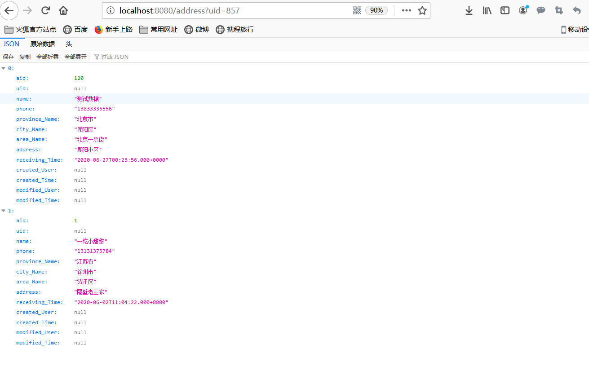
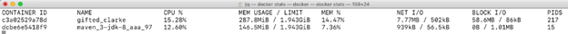

# **帮跑跑项目介绍文档**

## 一、作品背景

​		随着网络的不断发展和升级，互联网结合快递诞生了网上购物，越来越多的大学生喜欢只是坐在电脑面前动动手指头就能把自己下要的东西买下来，然而大学生在快递到时因为有事情忙，或者是其他原因耽搁或者是犯懒，懒得动不想出宿舍拿快递或者买饭买零食的现象在大学生活屡见不鲜。

​		而针对这种现象，我们开发了帮跑跑微信小程序，帮跑跑是类似于菜鸟裹裹的一种线上接单线下完成任务的校园电商平台，只要在微信上动动手指，就会有人帮你拿快递，帮你买东西、送东西。

​		

## 二、作品描述

### （一）我需要帮忙

#### 1 寻求帮助

在`跑腿`界面下的帮我标签下有我们日常可发起的三种帮助，分别为：

- 帮我取
    - 快递
    - 外卖
    - 其他
- 帮我买
    - 食品
    - 饮品
    - 文具
    - 其他
- 帮我送
    - 文件
    - 课本
    - 其他

当需要发起帮助时，只需选择对应的类别图标，将会进入订单填写界面

在相应的文本框内输入对应信息即可进行放单，订单将会在订单大厅（我帮）显示

#### 2 等待接单

当订单被接，即可收到信息，此时只需要安静等待，必要时会通过您留下的联系方式与您进行联系

订单状况可在订单界面进行查看，点击可进入详情页

#### 3 订单送达

订单送达后，即可确认订单

#### 4 订单完成

确认订单后，此轮订单完成，此次交易积分会在订单完成后累加到对方积分

### （二） 我想帮助别人

#### 1 寻找订单

在跑腿界面下的我帮标签下，即为接单大厅，可在当前界面点击帮定了进行帮助对方

#### 2 根据提示进行帮助

当接单后消息会提示您，并在订单页会显示详情，只需按照提示完成此次帮助

#### 3 积分获取

当本次交易完成后，积分会自动累加到您的积分

#### 5 订单送达、订单完成

确认订单后，此轮订单完成

### （三）积分兑换

在我的积分内是积分明细与兑换中心

您可在兑换中心进行礼品兑换

获取积分规则：根据预估价值与距离进行一个积分换算

### （四） 地址管理

地址管理可以添加您的常用地址并对其进行管理，省去了频繁点位选点的麻烦

​		

## 三、技术开发方案

### （一）技术栈

WXML+WXSS+JS,Vant,Vue.js,SpringBoot,MySQL,Redis,RabbitMQ,Nginx,Tomcat等

### （二）架构图

### （三）数据库表的设计

#### 1.微信用户WxAccount

|      字段名      | 数据类型 | 数据属性 |         字段说明         | 备注 |
| :--------------: | :------: | :------: | :----------------------: | :--: |
|       uid        |   INT    | NOT NULL |          用户id          |      |
|     open_id      | VARCHAR  | NOT NULL | 普通用户的一个唯一的标识 |      |
|   session_key    | VARCHAR  | NOT NULL |                          |      |
|    nick_name     | VARCHAR  | NOT NULL |           昵称           |      |
| encoded_password | VARCHAR  | NOT NULL |        加密的密码        |      |
|      gender      | VARCHAR  |   NULL   |           性别           |      |
|     country      | VARCHAR  |   NULL   |           国家           |      |
|     province     | VARCHAR  |   NULL   |           省份           |      |
|       city       | VARCHAR  |   NULL   |           城市           |      |
|    avatar_url    | VARCHAR  |   NULL   |         头像地址         |      |
|   created_user   | VARCHAR  | NOT NULL |       日志：创建人       |      |
|   created_time   | DATETIME | NOT NULL |      日志：创建时间      |      |
|  modified_user   | VARCHAR  | NOT NULL |       日志：修改人       |      |
|  modified_time   | DATETIME | NOT NULL |      日志：修改时间      |      |

#### 2.收货地址Address

|     字段名     | 数据类型 | 数据属性 |    字段说明    | 备注 |
| :------------: | :------: | :------: | :------------: | :--: |
|      aid       |   INT    | NOT NULL |   收货地址ID   |      |
|      uid       |   INT    | NOT NULL |     用户ID     |      |
|      name      | VARCHAR  | NOT NULL |   收货人姓名   |      |
|     phone      | VARCHAR  | NOT NULL |    手机号码    |      |
| province_name  | VARCHAR  | NOT NULL |      省名      |      |
|   city_name    | VARCHAR  | NOT NULL |      市名      |      |
|   area_name    | VARCHAR  | NOT NULL |      区名      |      |
|     adress     | VARCHAR  | NOT NULL |    详细地址    |      |
| receiving_time | DATETIME | NOT NULL |    收货时间    |      |
|  created_user  | VARCHAR  | NOT NULL |  日志：创建人  |      |
|  created_time  | DATETIME | NOT NULL | 日志：创建时间 |      |
| modified_user  | VARCHAR  | NOT NULL |  日志：修改人  |      |
| modified_time  | DATETIME | NOT NULL | 日志：修改时间 |      |

#### 3.订单Order

|      字段名       | 数据类型 | 数据属性 |    字段说明    |                          备注                           |
| :---------------: | :------: | :------: | :------------: | :-----------------------------------------------------: |
|        oid        |   INT    | NOT NULL |     订单id     |                                                         |
|       title       | VARCHAR  | NOT NULL |    订单名称    |                                                         |
|      catalog      | VARCHAR  | NOT NULL |    订单类型    |                                                         |
|    creater_id     | VARCHAR  | NOT NULL |    放单人ID    |                                                         |
|   creater_name    | VARCHAR  | NOT NULL |   放单人姓名   |                                                         |
|    creater_tel    | VARCHAR  | NOT NULL | 放单人联系方式 |                                                         |
| creater_longitude |  DOUBLE  | NOT NULL | 放单人位置经度 |                                                         |
| creater_latitude  |  DOUBLE  | NOT NULL | 放单人位置纬度 |                                                         |
| shops_longtitude  |  DOUBLE  | NOT NULL |  商家位置经度  |                                                         |
|  shops_latitude   |  DOUBLE  | NOT NULL |  商家位置纬度  |                                                         |
|    acctpter_id    | VARCHAR  |   NULL   |    接单人ID    |                                                         |
|    create_date    | DATETIME | NOT NULL |  订单放单时间  |                                                         |
|    accept_date    | DATETIME |   NULL   |  订单接受时间  |                                                         |
|   public_field1   | VARCHAR  |   NULL   |   公共字段1    |                     由订单类型决定                      |
|   public_field2   | VARCHAR  |   NULL   |   公共字段2    |                     由订单类型决定                      |
|  estimated_worth  |   INT    | NOT NULL |    预估价值    |                                                         |
|      remark       | VARCHAR  |   NULL   |      备注      |                                                         |
|        aid        |   INT    |   NULL   |     评价id     |                    后期评价后会生成                     |
|      reward       |   INT    | NOT NULL |    奖励积分    |                   根据距离和价值决定                    |
|      status       |   INT    | NOT NULL |    订单状态    | 0未接单,1已接单,2送货中,3已接收,4已评价,5已取消,6已删除 |
|   created_user    | VARCHAR  | NOT NULL |  日志：创建人  |                                                         |
|   created_time    | DATETIME | NOT NULL | 日志：创建时间 |                                                         |
|   modified_user   | VARCHAR  | NOT NULL |  日志：修改人  |                                                         |
|   modified_time   | DATETIME | NOT NULL | 日志：修改时间 |                                                         |

#### 4.订单的评价Appraise

|    字段名     | 数据类型 | 数据属性 |    字段说明    |                      备注                      |
| :-----------: | :------: | :------: | :------------: | :--------------------------------------------: |
|      aid      |   INT    | NOT NULL |     评价id     |                                                |
|      oid      |   INT    | NOT NULL |     订单id     |                                                |
|     grade     |   INT    | NOT NULL |    评价等级    | 0，1，2，3四个等级(前端可以用五角星来展现等级) |
|    content    | VARCHAR  | NOT NULL |    评价内容    |                                                |
| created_user  | VARCHAR  | NOT NULL |  日志：创建人  |                                                |
| created_time  | DATETIME | NOT NULL | 日志：创建时间 |                                                |
| modified_user | VARCHAR  | NOT NULL |  日志：修改人  |                                                |
| modified_time | DATETIME | NOT NULL | 日志：修改时间 |                                                |

#### 5.经纬度位置Location

|    字段名     | 数据类型 | 数据属性 |    字段说明    | 备注 |
| :-----------: | :------: | :------: | :------------: | :--: |
|      lid      |   INT    | NOT NULL |     位置id     |      |
|      uid      |   INT    | NOT NULL |     用户id     |      |
|  longtitude   |  DOUBLE  | NOT NULL |   位置的经度   |      |
|   latitude    |  DOUBLE  | NOT NULL |   位置的纬度   |      |
| created_user  | VARCHAR  | NOT NULL |  日志：创建人  |      |
| created_time  | DATETIME | NOT NULL | 日志：创建时间 |      |
| modified_user | VARCHAR  | NOT NULL |  日志：修改人  |      |
| modified_time | DATETIME | NOT NULL | 日志：修改时间 |      |

#### 6.通知Notification

|    字段名     | 数据类型 | 数据属性 |    字段说明    | 备注 |
| :-----------: | :------: | :------: | :------------: | :--: |
|      nid      |   INT    | NOT NULL |     通知id     |      |
| from_open_id  | VARCHAR  | NOT NULL |                |      |
|   from_uid    |   INT    | NOT NULL |    通知人id    |      |
|  to_open_id   | VARCHAR  | NOT NULL |                |      |
|    to_uid     |   INT    | NOT NULL |   被通知人id   |      |
|     title     | VARCHAR  | NOT NULL |      主题      |      |
|    message    | VARCHAR  | NOT NULL |    内容信息    |      |
| created_user  | VARCHAR  | NOT NULL |  日志：创建人  |      |
| created_time  | DATETIME | NOT NULL | 日志：创建时间 |      |
| modified_user | VARCHAR  | NOT NULL |  日志：修改人  |      |
| modified_time | DATETIME | NOT NULL | 日志：修改时间 |      |

#### 7.积分管理Reward

|    字段名     | 数据类型 | 数据属性 |    字段说明    | 备注 |
| :-----------: | :------: | :------: | :------------: | :--: |
|      rid      |   INT    | NOT NULL |     积分id     |      |
|    open_Id    | VARCHAR  | NOT NULL |    用户的id    |      |
|     date      | DATETIME | NOT NULL |      时间      |      |
|    matter     | VARCHAR  | NOT NULL |      事情      |      |
|    changed    |   INT    | NOT NULL |      变化      |      |
|    reward     |   INT    | NOT NULL |    剩余积分    |      |
| created_user  | VARCHAR  | NOT NULL |  日志：创建人  |      |
| created_time  | DATETIME | NOT NULL | 日志：创建时间 |      |
| modified_user | VARCHAR  | NOT NULL |  日志：修改人  |      |
| modified_time | DATETIME | NOT NULL | 日志：修改时间 |      |

### （四）api文档

#### 用户管理

##### 1.用户注册

|       URI       |                           /signup                            |
| :-------------: | :----------------------------------------------------------: |
|    作用描述     |                           用户注册                           |
|    请求方式     |                             POST                             |
| 传入 api 的参数 | JSONObject requestjson 带有nickname，password，repeatpassword的json |
|  返回数据格式   |                             Json                             |

##### .微信用户授权登录

|       URI       |                        /auth/wxlogin                         |
| :-------------: | :----------------------------------------------------------: |
|    作用描述     |                       微信用户授权登录                       |
|    请求方式     |                             POST                             |
| 传入 api 的参数 | WxAuthenticationToken wxAuthenticationToken 微信用户的登录凭证 |
|  返回数据格式   |                             Json                             |

##### 3.用户名和密码登录

|       URI       |                     /restlogin                      |
| :-------------: | :-------------------------------------------------: |
|    作用描述     |                  用户名和密码登录                   |
|    请求方式     |                        POST                         |
| 传入 api 的参数 | JSONObject requestjson 带有nickname，password的Json |
|  返回数据格式   |                        Json                         |

##### 4.加载用户信息

|       URI       |                    /auth/uploadWxUserinfo                    |
| :-------------: | :----------------------------------------------------------: |
|    作用描述     |                         加载用户信息                         |
|    请求方式     |                             POST                             |
| 传入 api 的参数 | JSONObject userinfo 带有用户信息的json, WxAuthenticationToken wxAuthenticationToken 微信用户的登录凭证 |
|  返回数据格式   |                             Json                             |

##### 5.加载头像信息

|       URI       |                      /auth/uploadAvatar                      |
| :-------------: | :----------------------------------------------------------: |
|    作用描述     |                         加载头像信息                         |
|    请求方式     |                             POST                             |
| 传入 api 的参数 | WxAuthenticationToken wxAuthenticationToken 微信用户的登录凭证, MultipartFile file 头像文件路径 |
|  返回数据格式   |                             Json                             |

##### 6.获取用户信息

|       URI       |                         /getuserinfo                         |
| :-------------: | :----------------------------------------------------------: |
|    作用描述     |                         获取用户信息                         |
|    请求方式     |                             GET                              |
| 传入 api 的参数 | WxAuthenticationToken wxAuthenticationToken 微信用户的登录凭证 |
|  返回数据格式   |                             Json                             |

##### 7.更改头像

|       URI       |                          /setavatar                          |
| :-------------: | :----------------------------------------------------------: |
|    作用描述     |                           更改头像                           |
|    请求方式     |                             POST                             |
| 传入 api 的参数 | ServletRequest request, WxAuthenticationToken wxAuthenticationToken, @RequestParam("file") MultipartFile[] multipartFile, ServletRequest servletRequest |
|  返回数据格式   |                             Json                             |

#### 地址管理:

##### 1.添加新的收货地址

|       URI       |                       /address/addNew                        |
| :-------------: | :----------------------------------------------------------: |
|    作用描述     |     点击保存按钮后，新增用户想要新添加的一条收货地址数据     |
|    请求方式     |                             POST                             |
| 传入 api 的参数 | Address address 地址数据，Integer uid 用户id，String username 用户名 |
|  返回数据格式   |                             Json                             |

##### 2.删除收货地址

|       URI       |                    /address/{aid}/delete                     |
| :-------------: | :----------------------------------------------------------: |
|    作用描述     |  点击地址管理某条地址的删除按钮后，删除改该用户的此地址数据  |
|    请求方式     |                            DELETE                            |
| 传入 api 的参数 | Integer aid 地址id，Integer uid 用户id，String username 用户名 |
|  返回数据格式   |                             Json                             |

##### 3.更新/修改地址

|       URI       |                    /address/{aid}/update                     |
| :-------------: | :----------------------------------------------------------: |
|    作用描述     | 用户重新编辑某条已经存在的地址数据后，点保存按钮后，修改用户的某条地址数据 |
|    请求方式     |                             POST                             |
| 传入 api 的参数 | Integer aid 地址id，Integer uid 用户id，String username 用户名，Address address 修改后的地址 |
|  返回数据格式   |                             Json                             |

##### 4.获取全部地址

|       URI       |                           /address                           |
| :-------------: | :----------------------------------------------------------: |
|    作用描述     | 某用户进入地址管理页面后，应该能够看到属于自己的所有地址数据 |
|    请求方式     |                             GET                              |
| 传入 api 的参数 |                      Integer uid 用户名                      |
|  返回数据格式   |                             Json                             |

##### 5.根据aid获取地址

|       URI       |                             null                             |
| :-------------: | :----------------------------------------------------------: |
|    作用描述     | 一条地址数据在多个页面需要出现，就可通过传递该地址的id，将id传入后端查表即可 |
|    请求方式     |                             GET                              |
| 传入 api 的参数 |                      Integer aid 地址id                      |
|  返回数据格式   |                             Json                             |

#### 订单管理:

##### 1.创建或修改订单

|       URI       |     /order/edit      |
| :-------------: | :------------------: |
|    作用描述     | 用户创建新的订单数据 |
|    请求方式     |         POST         |
| 传入 api 的参数 |   Order order 订单   |
|  返回数据格式   |         Json         |

##### 2.删除订单

|       URI       |                 /order/delete                  |
| :-------------: | :--------------------------------------------: |
|    作用描述     |                删除对应订单数据                |
|    请求方式     |                     DELETE                     |
| 传入 api 的参数 | JSONObject jsonObject（带有orderId的JSON对象） |
|  返回数据格式   |                      Json                      |

##### 3.取消订单

|       URI       |                 /order/cancel                  |
| :-------------: | :--------------------------------------------: |
|    作用描述     |            将订单数据修改为取消状态            |
|    请求方式     |                      POST                      |
| 传入 api 的参数 | JSONObject jsonObject（带有orderId的JSON对象） |
|  返回数据格式   |              Json（带有通知数据）              |

##### 4.修改状态为已接单

|       URI       |                  /order/accept                  |
| :-------------: | :---------------------------------------------: |
|    作用描述     |           将订单数据修改为已接单状态            |
|    请求方式     |                      POST                       |
| 传入 api 的参数 | Long orderId 订单id，String accepterId 接单人id |
|  返回数据格式   |              Json（ 包含通知数据）              |

##### 5.修改状态为送货中

|       URI       |                 /order/deliver                 |
| :-------------: | :--------------------------------------------: |
|    作用描述     |           将订单数据修改为送货中状态           |
|    请求方式     |                      POST                      |
| 传入 api 的参数 | JSONObject jsonObject（带有orderId的JSON对象） |
|  返回数据格式   |             Json（ 包含通知数据）              |

##### 6.修改状态为已接收

|       URI       |                 /order/receive                 |
| :-------------: | :--------------------------------------------: |
|    作用描述     |           将订单数据修改为已接收状态           |
|    请求方式     |                      POST                      |
| 传入 api 的参数 | JSONObject jsonObject（带有orderId的JSON对象） |
|  返回数据格式   |             Json（ 包含通知数据）              |

##### 7.根据id查询订单信息

|       URI       |   /order/list/{id}   |
| :-------------: | :------------------: |
|    作用描述     | 查出对应id的订单信息 |
|    请求方式     |         GET          |
| 传入 api 的参数 |    Long id 订单id    |
|  返回数据格式   |         Json         |

##### 8.根据订单类型分页查询全部订单信息

|       URI       |                     /order/list_catalog                      |
| :-------------: | :----------------------------------------------------------: |
|    作用描述     |               根据订单类型分页查询全部订单信息               |
|    请求方式     |                             GET                              |
| 传入 api 的参数 | String catalog 分类，String orderBy 排序，int pageIndex 分页的页号，int pageSize 分页的size |
|  返回数据格式   |                             Json                             |

##### 9.根据订单状态和用户的openid分页查询全部订单信息

|       URI       |                     /order/list_idstatus                     |
| :-------------: | :----------------------------------------------------------: |
|    作用描述     |        根据订单状态和用户的openid分页查询全部订单信息        |
|    请求方式     |                             GET                              |
| 传入 api 的参数 | String id 用户的openId，int status 订单状态，int pageIndex 分页的页号，int pageSize 分页的size |
|  返回数据格式   |                             Json                             |

##### 10.根据用户的openid分页查询全部订单信息

|       URI       |                      /order/list_status                      |
| :-------------: | :----------------------------------------------------------: |
|    作用描述     |             根据用户的openid分页查询全部订单信息             |
|    请求方式     |                             GET                              |
| 传入 api 的参数 | String id 用户的openID，int pageIndex 分页的页号，int pageSize 分页的size |
|  返回数据格式   |                             Json                             |

##### 11.根据名称模糊查询

|       URI       |                        /order/search                         |
| :-------------: | :----------------------------------------------------------: |
|    作用描述     |                       根据名称模糊查询                       |
|    请求方式     |                             GET                              |
| 传入 api 的参数 | String title 查询关键词，int pageIndex 分页的页号，int pageSize 分页的size |
|  返回数据格式   |                             Json                             |

#### 评价管理：

##### 1.添加评价

|       URI       |              /appraise/create              |
| :-------------: | :----------------------------------------: |
|    作用描述     |    在某个已经完成订单上添加新的评价数据    |
|    请求方式     |                    POST                    |
| 传入 api 的参数 | Integer oid 订单id，Appraise appraise 评价 |
|  返回数据格式   |                    Json                    |

##### 2.删除评价

|       URI       |      /appraise/{aid}/delete      |
| :-------------: | :------------------------------: |
|    作用描述     | 删除某个订单数据上已经存在的评价 |
|    请求方式     |              DELETE              |
| 传入 api 的参数 |        Integer aid 评价id        |
|  返回数据格式   |               Json               |

##### 3.查询某个评价

|       URI       |  /appraises/{aid}/get  |
| :-------------: | :--------------------: |
|    作用描述     | 根据id获得对应评价数据 |
|    请求方式     |          GET           |
| 传入 api 的参数 |   Integer aid 评价id   |
|  返回数据格式   |          Json          |

##### 4.查询某订单的所有评价

|       URI       |               /appraises/{oid}               |
| :-------------: | :------------------------------------------: |
|    作用描述     | 查看某订单数据时应该获得该订单的所有评价数据 |
|    请求方式     |                     GET                      |
| 传入 api 的参数 |              Integer oid 订单id              |
|  返回数据格式   |                     Json                     |

#### 通知管理：

##### 1获取全部消息通知

|       URI       | /notification/{openid}/getnotification |
| :-------------: | :------------------------------------: |
|    作用描述     |     根据被通知的id获得所有通知数据     |
|    请求方式     |                  GET                   |
| 传入 api 的参数 |     url上的String openid被通知的id     |
|  返回数据格式   |                  Json                  |

##### 2获取某用户的全部系统通知

|       URI       | /notification/{openid}/getsystemnotification |
| :-------------: | :------------------------------------------: |
|    作用描述     |    根据被通知的id获取某用户的全部系统通知    |
|    请求方式     |                     GET                      |
| 传入 api 的参数 |        url上的String openid被通知的id        |
|  返回数据格式   |                     Json                     |

##### 3.获取一条消息通知

|       URI       |   /notification/{openid}/getnotification/{notificationid}    |
| :-------------: | :----------------------------------------------------------: |
|    作用描述     |            根据被通知的id和通知id获得对应通知数据            |
|    请求方式     |                             GET                              |
| 传入 api 的参数 | url上的String openid被通知的id，url上的int notificationid通知数据id |
|  返回数据格式   |                             Json                             |

##### 4.删除通知

|       URI       |  /notification/{openid}/deletenotification/{notificationid}  |
| :-------------: | :----------------------------------------------------------: |
|    作用描述     |                  根据通知id删除对应通知数据                  |
|    请求方式     |                            DELETE                            |
| 传入 api 的参数 | url上的 String openid （被通知的id），url上的String notificationid （通知数据的id） |
|  返回数据格式   |                             Json                             |

##### 5.发送通知

|       URI       |    /notification/{fromopenid}/postnotification/toopenid/     |
| :-------------: | :----------------------------------------------------------: |
|    作用描述     |                         新增通知数据                         |
|    请求方式     |                             POST                             |
| 传入 api 的参数 | url上的String fromopenid(通知的id)和String toopenid（被通知的id）。String title 消息头，String msg 消息内容 |
|  返回数据格式   |                             Json                             |

#### 用户反馈

|       URI       |              /feedback/              |
| :-------------: | :----------------------------------: |
|    作用描述     | 用户发表意见反馈，管理员会从后台看到 |
|    请求方式     |                 POST                 |
| 传入 api 的参数 |    openid和String msg反馈消息内容    |
|  返回数据格式   |                 Json                 |

#### 积分管理

##### 1.获取用户最后一次积分变动

|       URI       | /reward/{openid}/getlast |
| :-------------: | :----------------------: |
|    作用描述     | 获取用户最后一次积分变动 |
|    请求方式     |           GET            |
| 传入 api 的参数 |   String openid 用户id   |
|  返回数据格式   |           JSON           |

##### 2.获取用户积分明细

|       URI       | /reward/{openid}/getdetails |
| :-------------: | :-------------------------: |
|    作用描述     |      获取用户积分明细       |
|    请求方式     |             GET             |
| 传入 api 的参数 |    String openid 用户id     |
|  返回数据格式   |            JSON             |

##### 3.积分变动

|       URI       |       /reward/change       |
| :-------------: | :------------------------: |
|    作用描述     |          积分变动          |
|    请求方式     |            POST            |
| 传入 api 的参数 | Reward reward 积分数据对象 |
|  返回数据格式   |            JSON            |

## 四、系统测试

### （一）功能测试

#### 1.接受订单测试

在接单人接受了发单人的订单后，应当将订单状态改变，并且将接受订单人的数据写入到数据库中，

并且能够接受到订单状态改变的消息通知，反馈给前端，呈现给用户，让用户得知订单消息

#### 2.获取用户收货地址测试

输入对应url和必要用户参数后，能够获得用户收货地址数据

### （二） 性能测试

由于本系统采用分布式部署。在4核心的6700HQ CPU中运行该系统，最大PV(page view)即页面浏览量为5k每秒。在这样一颗CPU中可以同时运行400个左右的活跃用户。如果部署到更高级的服务器CPU中，则会更加强大。多台服务器可以进一步加快效率。

### （三） 安全测试

本文安全认证方法使用Oauth 2协议的Spring Security组件，对服务器端相互通信的API和小程序与服务器端的通信进行保护。

小程序访问服务器区分权限，如果没有相应权限，则无法访问，返回状态码401。

